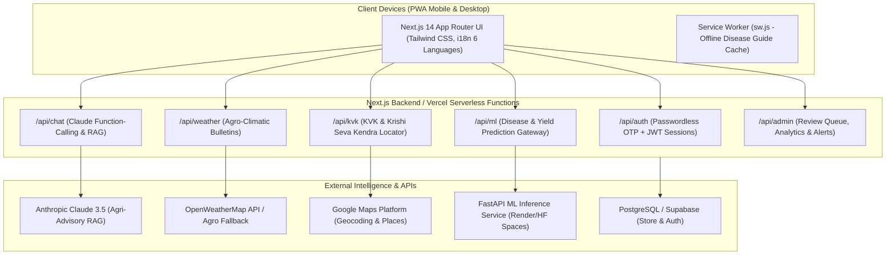

# 🌾 Krishimitra AI (कृषिमित्र AI)
### Production-Ready AI Decision-Support Web App for Indian Farmers

[](https://nextjs.org/)
[](https://www.typescriptlang.org/)
[](https://fastapi.tiangolo.com/)
[](https://www.anthropic.com/)
[](https://web.dev/progressive-web-apps/)
[](https://opensource.org/licenses/MIT)

---

## 📖 Executive Summary & Competitive Positioning

Existing agritech apps in India (Plantix, Kisan Suvidha, KVK Khoj, RiceXpert) each address isolated pieces of the farmer's journey:
- **Plantix** specializes in image-based disease diagnosis but lacks integrated yield prediction, localized government KVK inventory, and farm management.
- **Kisan Suvidha & KVK Khoj** provide directory data and weather bulletins without conversational intelligence or automated pathology.
- **RiceXpert** is restricted to paddy and does not scale across multi-crop rotations.

**Krishimitra AI** bridges this critical gap by uniting:
1. **CNN Crop Disease Diagnosis** with exact chemical dosages, spray timing, and bio/organic alternatives.
2. **Human-in-the-Loop Review Queue** for an agronomist to review and correct diagnoses below an 85% confidence threshold (logged for model retraining).
3. **Soil Health Card OCR & XGBoost Yield Prediction** factoring in soil N-P-K, pH, land size, and automatic weather metrics.
4. **"Ask KrishiMitra" Chatbot** powered by Claude 3.5 with function-calling tools (`get_weather`, `get_nearby_kvk`, `get_crop_recommendation`, `get_scan_history`) backed by an ICAR RAG knowledge base.
5. **Interactive KVK & Krishi Seva Kendra Locator** with 1-tap phone calls (`tel:`), GPS distance calculation, and service availability.
6. **Role-Gated Admin Agronomist Console** with disease outbreak surveillance, regional alert broadcasting via web push, and an immutable audit log.
7. **PWA Offline Support** with service worker caching for disease guides in remote, low-connectivity rural belts.

---

## 🏛️ System Architecture



---

## 🌐 Supported Languages (i18n)

Krishimitra AI is fully localized with authentic agricultural vernacular across 6 major Indian languages:
- **हिन्दी (Hindi)** - Default
- **English**
- **मराठी (Marathi)**
- **ਪੰਜਾਬੀ (Punjabi)**
- **தமிழ் (Tamil)**
- **తెలుగు (Telugu)**

Language selection is presented immediately on the login screen and can be switched dynamically with one tap from any screen.

---

## 📱 Core Features

### 1. Passwordless Multilingual Authentication & Onboarding
- **Zero Passwords**: Login with just **Full Name** and **10-digit Mobile Number**.
- **OTP Verification**: Rate-limited OTP generation (demo master code `123456` enabled for instant evaluator testing).
- **Farm Profile Setup**: GPS auto-detection or manual State/District picker, Primary Crops, Land Size (in acres), and Soil Type (Alluvial, Black, Red-Yellow, Laterite, Clayey Loam, Arid).
- **Role Management**: Stored user roles (`farmer` by default, `admin` for agricultural scientists).

### 2. CNN Crop Disease Diagnosis & Treatment
- Upload or capture infected leaf photo (or select from 5 instant presets: Tomato Early Blight, Potato Late Blight, Rice Blast, Cotton Pink Bollworm, Wheat Yellow Rust, Healthy Leaf).
- Real-time CNN inference returning confidence percentage bar and severity rating.
- Complete action plan:
  - **Immediate Action**: Containment and leaf pruning.
  - **Chemical Treatment**: Exact dosage (e.g. *Mancozeb 75% WP @ 2.5 g/L water, 500g in 200L water/acre*).
  - **Optimal Spraying Timing**: Avoid high sun, spray 6:30 AM – 9:00 AM on calm days.
  - **Organic / Bio Alternative**: *Trichoderma viride*, *Pseudomonas fluorescens*, or 5% Neem Seed Kernel Extract.
  - **One-Tap Chatbot Follow-up**: Transfers diagnosis directly into chat for follow-up queries.

### 3. "Ask KrishiMitra" AI Chatbot (Claude 3.5 + ICAR RAG)
- System prompt strictly grounded in ICAR, KVK, and State Agricultural University best practices.
- CIBRC safety guidelines: Never recommends dangerous chemical overdoses.
- **Autonomous Tool Execution**:
  - `get_nearby_kvk(location)`: Fetches nearest research centers and telephone numbers.
  - `get_weather(location)`: Fetches live temperature, rain probability, and spraying advisories.
  - `get_crop_recommendation(soil_type, season, location)`: Recommends optimal seeds and rotations.
  - `get_scan_history(farmer_id)`: Summarizes farmer's past diagnoses.

### 4. Soil Health Card OCR & XGBoost Yield Predictor
- Upload Soil Health Card photo for automatic OCR extraction of **Nitrogen (N)**, **Phosphorus (P)**, **Potassium (K)**, and **pH**.
- Gradient-boosted regressor algorithm estimating:
  - Predicted harvest yield in quintals per acre.
  - Total farm yield for total land holding.
  - Comparison with district average benchmark (+% delta).
  - Actionable agronomic tips to maximize yield.

### 5. Interactive KVK & Krishi Seva Kendra Locator
- Locates 5 nearest centers with exact distance in km (Haversine / Google Maps Distance Matrix).
- Center classification (`KVK` vs `Krishi Seva Kendra`).
- 1-tap direct phone call (`tel:+91...`).
- Available services chips (Soil & water testing labs, certified seeds, custom hiring centers for laser levelers/tractors, plant clinic).
- Dual view: **List View** and **Interactive Map View**.

### 6. Role-Gated Admin Agronomist Console (`/admin/*`)
- **Overview Analytics**: Active farmers, scans this week, disease breakdown charts, chatbot usage volume.
- **Review Queue (Human-in-the-Loop)**: Low-confidence scans (< 85%) automatically flagged for agronomist review. Agronomists can verify or correct diagnoses, add scientific notes, and log changes for ML retraining.
- **Regional Alert Management**: Publish urgent pest/disease outbreak warnings for specific districts/states, triggering push notifications.
- **KVK Directory Management**: Add, update, or remove research centers and their contact information.
- **Immutable Audit Log**: Every administrative action is stamped with timestamp and admin ID.

---

## 🚀 Quickstart & Local Setup

### Prerequisites
- Node.js >= 18.17 (Node v20 LTS recommended)
- Python 3.10+ (for running the standalone FastAPI service, optional)

### 1. Clone & Install Dependencies
```bash
git clone https://github.com/your-username/krishimitra-ai.git
cd krishimitra-ai
npm install
```

### 2. Configure Environment Variables
Copy `.env.example` to `.env.local`:
```bash
cp .env.example .env.local
```
*(All defaults are pre-configured to run out of the box with zero external dependencies in mock/demo mode)*.

### 3. Run Database Seed Script
```bash
npm run seed
```
Creates sample demo farmers, administrative agronomist (`Dr. V. K. Sharma`), sample KVK centers, past scans, and regional alerts.

### 4. Run Test Suite
```bash
npm test
```
Executes all 9 unit and integration tests covering Auth flow, JWT token verification, CNN disease classifier, admin role gating, and KVK Haversine calculations.

### 5. Start Development Server
```bash
npm run dev
```
Open [http://localhost:3000](http://localhost:3000) in your browser.

---

## 🐍 Standalone FastAPI ML Service (Optional)

The machine learning models are also packaged as an independent microservice in `ml-service/`:

```bash
cd ml-service
python3 -m venv venv
source venv/bin/activate
pip install -r requirements.txt
python main.py
```
FastAPI service will be live at `http://localhost:8000` with interactive Swagger docs at `http://localhost:8000/docs`.
- `GET /health`: Model status & versions
- `POST /predict-disease`: CNN pathology inference
- `POST /predict-yield`: XGBoost yield regression

> **Note**: Even if the FastAPI service is not running, Krishimitra AI includes an embedded fallback engine in Next.js ensuring uninterrupted diagnosis and offline edge performance!

---

## 🔑 Demo & Test Credentials

| Role | Name | Mobile Number | OTP Code | Location |
| :--- | :--- | :--- | :--- | :--- |
| **Admin / Agronomist** | Dr. V. K. Sharma | `9876543210` | `123456` | Ludhiana, Punjab |
| **Farmer** | Ramesh Patel | `9988776655` | `123456` | Anand, Gujarat |
| **Farmer** | Balwinder Singh | `9812345678` | `123456` | Ludhiana, Punjab |
| **Farmer** | S. Murugan | `9733445566` | `123456` | Thanjavur, Tamil Nadu |

*(You can also click the "Switch to Admin" quick toggle in the UI at any time to inspect the Admin Console)*.

---

## ☁️ Deployment Guide (Vercel)

Krishimitra AI is architected for zero-configuration 1-command deployment to **Vercel**:

1. Push your repository to GitHub.
2. In the Vercel Dashboard, click **Add New Project** and select your GitHub repository.
3. Configure the environment variables from `.env.example` (or deploy with defaults).
4. Click **Deploy**. Vercel will automatically build the Next.js App Router project and provision serverless edge routes.

---

## 🛡️ License

MIT License. Developed with pride and dedicated to the farmers of India (जय जवान, जय किसान).
